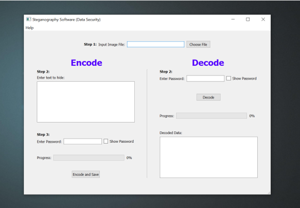

> 🚀 Solute_v1.0 is now available for Windows OS

&nbsp;

## Solute Application

Simplified steganography tool for your data privacy and security.
- Encrypt your text data securely inside an image.
- Decrypt your cover image with appropriate password only.

Not just encrypts the data, but also hides the presence of data.

&nbsp;
&nbsp;

## Application Preview

Currently supports Windows OS.

&nbsp;
&nbsp;

## Contributing

Contributions, issues, feature requests are welcome!

Feel free to check [issues page](https://github.com/SathvikPN/Steganography-application/issues)

&nbsp;
&nbsp;

Created with ❤ by <a href="https://www.linkedin.com/in/sathvik-p-n/">SathvikPN</a>

