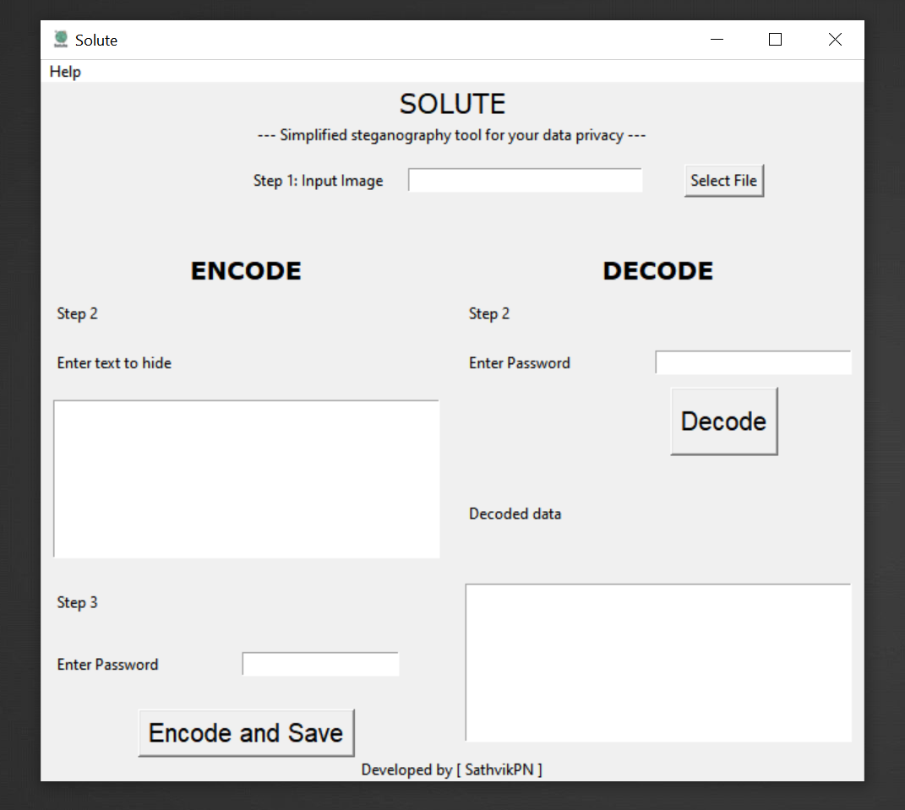

&nbsp;

## Solute Application

Simplified steganography tool for your data privacy and security.
- Encrypt your text data and hide securely inside an image.
- Decode data from cover image with correct password.

Not just encrypt the data, but also hide the presence of data.

&nbsp;
&nbsp;


## Run Locally

Clone the project

```bash
  git clone https://github.com/SathvikPN/Solute
```

Go to the project directory

```bash
  cd Solute
```

Install dependencies

```bash
  pip install -r requirements.txt
```

For Command Line Interface

```bash
  py solute_cli.py
```

For Graphical User Interface

```bash
  py solute_gui.py
```

&nbsp;

## Application Previews
---
Currently supports Windows OS.



### CLI Encoder Preview
---


### CLI Decoder Preview
---


## Contributing

Contributions, issues, feature requests are welcome!

Feel free to check [issues page](https://github.com/SathvikPN/Steganography-application/issues)


&nbsp;

This project is licensed under [MIT License](LICENSE)

&nbsp;

<p align="center">Created with ❤ by <a href="https://www.linkedin.com/in/sathvik-p-n/">SathvikPN</a></p>
