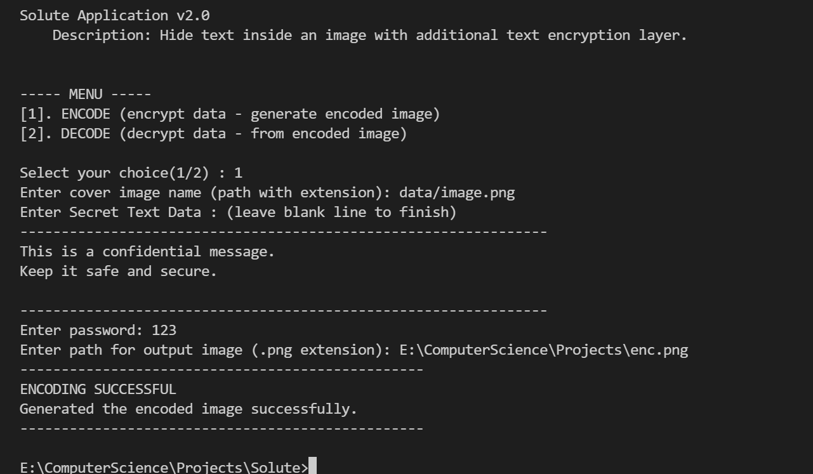
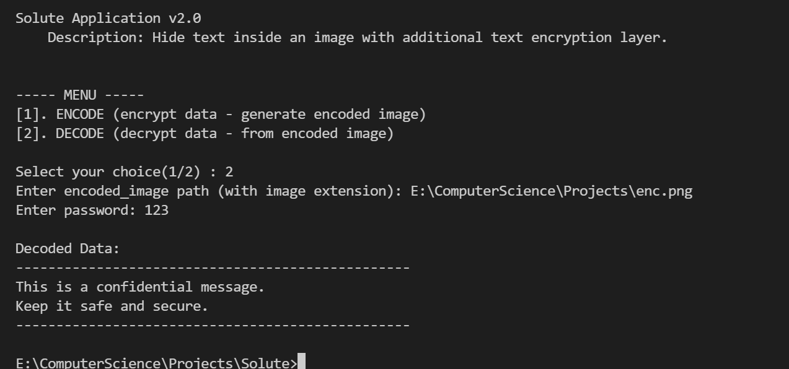

> 🚀 Solute is live. Yay! [Download](https://github.com/SathvikPN/Solute/releases/download/v2.0/Solute_v2.0.zip) 


&nbsp;

## Solute Application

Simplified steganography tool for your data privacy and security.
- Encrypt your text data and hide securely inside an image.
- Decode data from cover image with correct password.

Not just encrypt the data, but also hide the presence of data.

&nbsp;
&nbsp;


## Run Locally

Clone the project

```bash
  git clone https://github.com/SathvikPN/Solute
```

Go to the project directory

```bash
  cd Solute
```

Install dependencies

```bash
  pip install -r requirements.txt
```

```bash
usage: solute [-h] [-m MODE]

optional arguments:
  -h, --help  show this help message and exit
  -m MODE     Interface Mode: CLI or GUI (default: cli)
```

Run with preferred interface

```bash
python3 solute 
```

&nbsp;

## Application Previews

Currently supports Windows OS.


&nbsp;

### CLI Encoder Preview



&nbsp;

### CLI Decoder Preview



&nbsp;

## Contributing

Contributions, issues, feature requests are welcome!

Feel free to check [issues page](https://github.com/SathvikPN/Steganography-application/issues)


&nbsp;

[](https://github.com/SathvikPN/Solute/blob/main/LICENSE)

&nbsp;

<p align="center">Created with ❤ by <a href="https://www.linkedin.com/in/sathvik-p-n/">SathvikPN</a></p>


